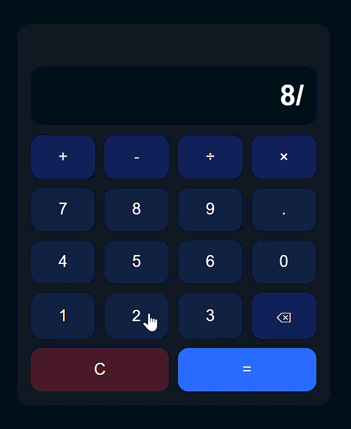
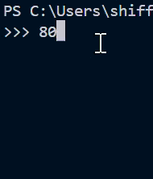
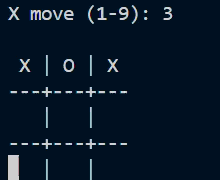

# Mini-Projects

## Beginner Level Projects

### 1. Core Logic Apps

<!-- markdownlint-disable MD033 -->

1. Calculator

   
   

2. Tic-Tac-Toe

   
   

3. Rock-Paper-Scissors

   

4. Dice Roller

   

5. Counter

   <source srcset="assets\counter-hover.gif" media="(hover:hover)">
   

6. Digital Clock

   

7. Stopwatch

   
   <source srcset="assets\stopwatch.gif" media="(hover:hover)">

8. Temperature Conversion
9. Typing Speed Test

### 2. Storage / CRUD Apps

1. To-Do List
2. Notes App
3. Bookmark Manager
4. Contact Manager
5. Personal Diary

### 3. API Practice

1. Weather App
2. Movie Search
3. Random User Generator
4. Quote Generator
5. Currency Converter

### 4. Forms & Validation

1. Login / Signup
2. Password Generator
3. Multi-Step Form
4. Survey / Quiz App
5. Markdown Blog Viewer

### 5. UI / Mini Tools

1. Portfolio Website
2. Recipe List Viewer
3. Theme Switcher
4. Image Gallery
5. URL Shortener

<!-- markdownlint-enable MD033 -->
