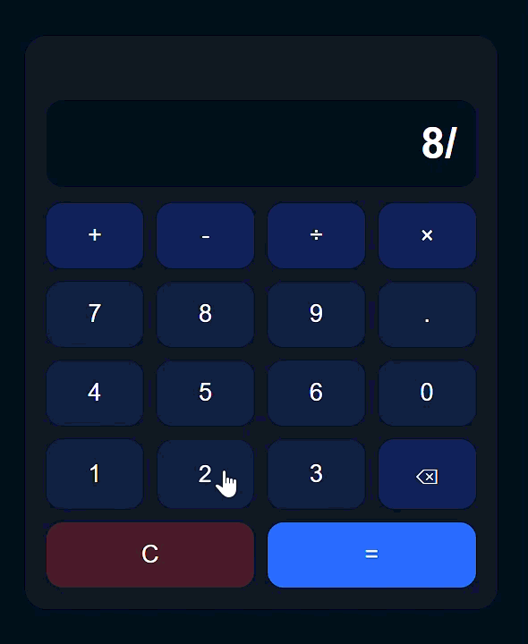
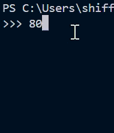
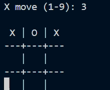
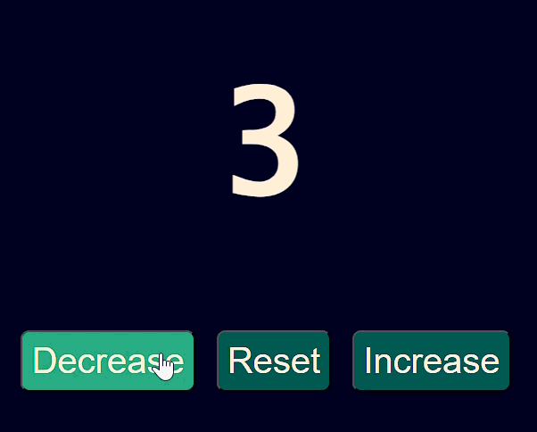
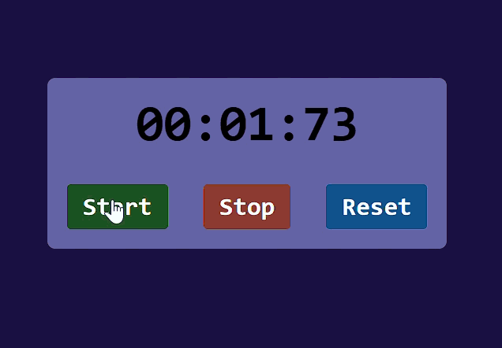
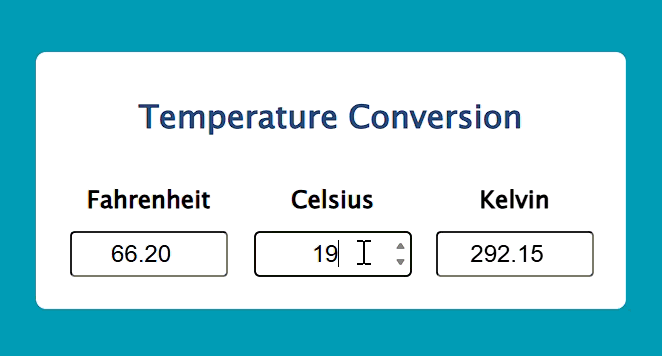

# Web Development Mini Projects

A collection of beginner web development projects built using **HTML, CSS, and JavaScript**.

## Technologies Used

- HTML
- CSS
- JavaScript

## Quick Navigation

- [Core Logic Apps](#1-core-logic-apps)
- [Storage / CRUD Apps](#2-storage--crud-apps)
- [API Practice](#3-api-practice)
- [Forms & Validation](#4-forms--validation)
- [UI / Mini Tools](#5-ui--mini-tools)

## 1. Core Logic Apps

<!-- markdownlint-disable MD033 -->

1. [Calculator](https://shiffananazeema.github.io/Mini-Projects/1.1%20Calculator/)

   
   

2. [Tic-Tac-Toe](https://shiffananazeema.github.io/Mini-Projects/1.2%20Tic-Tac-Toe/)

   
   

3. [Rock-Paper-Scissors](https://shiffananazeema.github.io/Mini-Projects/1.3%20Rock-Paper-Scissors/)

   

4. [Dice Roll](https://shiffananazeema.github.io/Mini-Projects/1.4%20Dice%20Roll/)

   

5. [Counter](https://shiffananazeema.github.io/Mini-Projects/1.5%20Counter/)

   

6. [Digital Clock](https://shiffananazeema.github.io/Mini-Projects/1.6%20Digital%20Clock/)

   

7. [Stopwatch](https://shiffananazeema.github.io/Mini-Projects/1.7%20Stopwatch/)

   

8. [Temperature Conversion](https://shiffananazeema.github.io/Mini-Projects/1.8%20Temperature%20Conversion/)

   

9. [Typing Test](https://shiffananazeema.github.io/Mini-Projects/1.9%20Typing%20Test/)

   

## 2. Storage / CRUD Apps

1. [To-Do List](https://shiffananazeema.github.io/Mini-Projects/2.1%20To-Do%20List/)

   

2. [Notes App](https://shiffananazeema.github.io/Mini-Projects/2.2%20Notes%20App/)

   

3. [Bookmark Manager](https://shiffananazeema.github.io/Mini-Projects/2.3%20Bookmark%20Manager/)

   

4. [Contact Manager](https://shiffananazeema.github.io/Mini-Projects/2.4%20Contact%20Manager/)

   

5. [Expense Tracker](https://shiffananazeema.github.io/Mini-Projects/2.5%20Expense%20Tracker/)

   

## 3. API Practice

1. <a href="https://shiffananazeema.github.io/Mini-Projects/3.1%20News%20App/" target="_blank" rel="noopener noreferrer">News App</a>

   

2. <a href="https://shiffananazeema.github.io/Mini-Projects/3.1%20News%20App/" target="_blank">News App</a>

   

3. Movie Search
4. GitHub User Search
5. Currency Converter

## 4. Forms & Validation

1. Login / Signup
2. Password Generator
3. Multi-Step Form
4. Survey / Quiz App
5. Markdown Blog Viewer

## 5. UI / Mini Tools

1. Portfolio Website
2. Recipe List Viewer
3. Theme Switcher
4. Image Gallery
5. URL Shortener

<!-- markdownlint-enable MD033 -->
